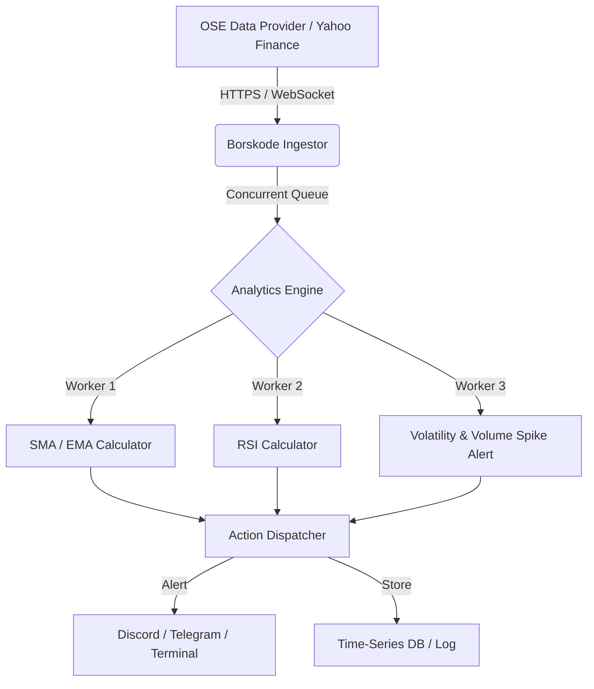

# Borskode

Borskode er en sanntidsanalysemotor for norske aksjekurser på Oslo Børs (OSE). Løsningen henter markedsdata, beregner tekniske indikatorer og kan sende varsler ved viktige kursbevegelser.

---

## Hva Borskode gjør

- Lav-latens datainnhenting via polling og streaming (WebSocket/HTTP)
- Beregning av tekniske indikatorer: SMA, EMA, RSI, volatilitet
- Mønsterdeteksjon for hendelser som flash crashes og volumspikes
- Varsler via Discord, Telegram eller terminal
- Håndtering av børsens åpningstider og API-rate limits

---

## Arkitekturoversikt (Borskode Pipeline)

Borskode er bygget som en reaktiv pipeline for å unngå blokkering i datainnhenting.



---

## Tekniske utfordringer (og hvordan vi håndterer dem)

### 1) Åpningstider på Oslo Børs
- Oslo Børs er åpen 09:00–16:25 CET på norske handelsdager.
- Systemet må kunne stoppe datainnhenting når børsen er stengt.

### 2) Samtidighet og skalering
- Hver ticker behandles uavhengig for å unngå blokkering og forsinkelse.
- Løsning: Bruk thread pools / ForkJoinPool sammen med trådsikre datastrukturer (ConcurrentHashMap, BlockingQueue).

### 3) Statistikk og signalering
- Bruk glidende gjennomsnitt (SMA/EMA) og RSI for å redusere falske signaler.
- Eksempel:
  - SMA: gjennomsnittspris over siste N minutter
  - RSI: måler hastighet og endring i prisbevegelsen

---

## Prosjektstruktur (planlagt)

```text
ingestor/        # Innhenter markedsdata
models/          # Datastrukturer
analytics/       # Indikator-motorer og signalgeneratorer
alerts/          # Varslingskanaler (Discord, e-post, osv.)
storage/         # Lagring 
cli/             # Kommando-linje / dashboard-grensesnitt
```

---

## Veien videre (roadmap)

- Fase 1: Stabil tilkobling mot datakilder (Yahoo Finance / WebSocket / egen broker API)
- Fase 2: Effektiv intern buffer (CircularBuffer) for tidserie-data uten å fylle RAM
- Fase 3: Live-terminal-dashboard for top 10 Oslo Børs-aksjer
- Fase 4: Backtesting og historiske analyser

