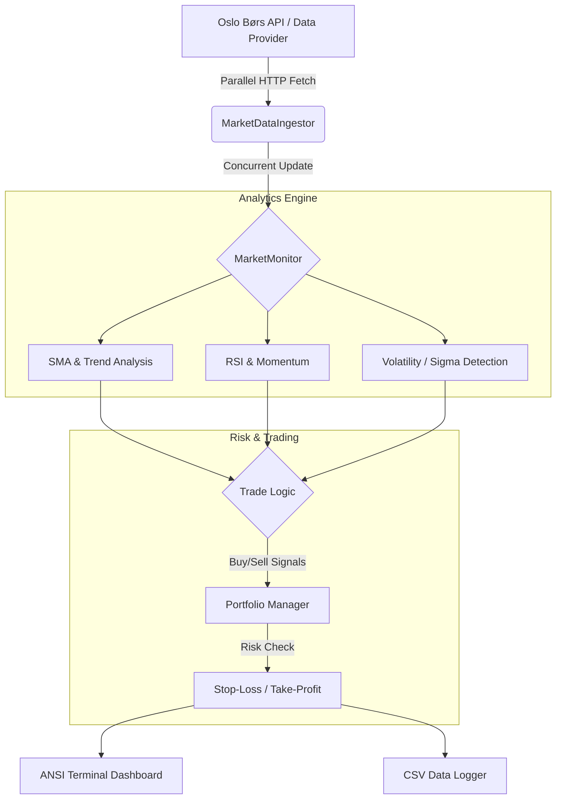

# Børskode Engine

Børskode Engine er en høyytelses analysemotor og trading-terminal for Oslo Børs, skrevet i Java. Systemet henter markedsdata i parallell, utfører avansert teknisk analyse i sanntid, og kjører en integrert handelssimulator (Paper Trading) med aktiv risikostyring.

## Innhold

- [Funksjoner](#funksjoner)
- [Systemarkitektur](#systemarkitektur)
- [Systemoversikt (klasser og ansvar)](#systemoversikt-klasser-og-ansvar)
- [Demo: Terminal Dashboard](#demo-terminal-dashboard)
- [Installasjon og bruk](#installasjon-og-bruk)

## Funksjoner

- Parallell Data-Ingestor: Benytter trådbaserte pools for å hente kurser fra flere kilder samtidig med minimal latens.
- Teknisk analyse-motor:
  - SMA (Simple Moving Average): Trendidentifisering over 14 perioder.
  - RSI (Relative Strength Index): Momentum-analyse for å identifisere overkjøpte (>70) eller oversolgte (<30) verdier.
- 2-Sigma deteksjon: Statistisk analyse av volatilitet for å varsle om unormale prishopp eller fall (flash crashes).
- Paper Trading Simulator: Fullverdig porteføljestyring med 100 000 NOK startkapital, sporing av kontanter og aksjebeholdning.
- Aktiv risikostyring:
  - Stop-loss (-2%)
  - Take-profit (+5%)
- Live ANSI-terminal: Fargekodet dashboard som oppdateres in-place uten flimring.

## Systemarkitektur

Systemet følger en reaktiv pipeline-arkitektur for å sikre trådsikkerhet og maksimal ytelse under høy belastning.



## Systemoversikt (klasser og ansvar)

| Modul | Klasse | Ansvar |
| --- | --- | --- |
| Ingestor | MarketDataIngestor | Håndterer tråd-pools og asynkron polling av markedsdata. |
| Analytics | MarketMonitor | Hovedhjerne. Analyserer signaler og trigger handelsordre. |
| Analytics | PriceHistoryBuffer | Sirkulær buffer som holder på historiske priser for SMA/RSI. |
| Trading | Portfolio | Holder styr på saldo, beholdning og beregner sanntidsverdi (PnL). |
| UI | TerminalDashboard | Rendrer det visuelle grensesnittet med ANSI-fargekoding. |
| Models | Ticker | Datamodell for aksjeinformasjon og prisendringer. |

## Demo: Terminal Dashboard

Dashboardet gir en visuell oversikt over marked og portefølje:


## Installasjon og bruk

### Forutsetninger

- Java Development Kit (JDK) 17 eller nyere.

### Kjøring

1. Klon repoet.
2. Kompiler alle filer:

```bash
javac -d bin src/**/*.java Main.java
```

3. Start programmet:

```bash
java -cp bin Main
```

